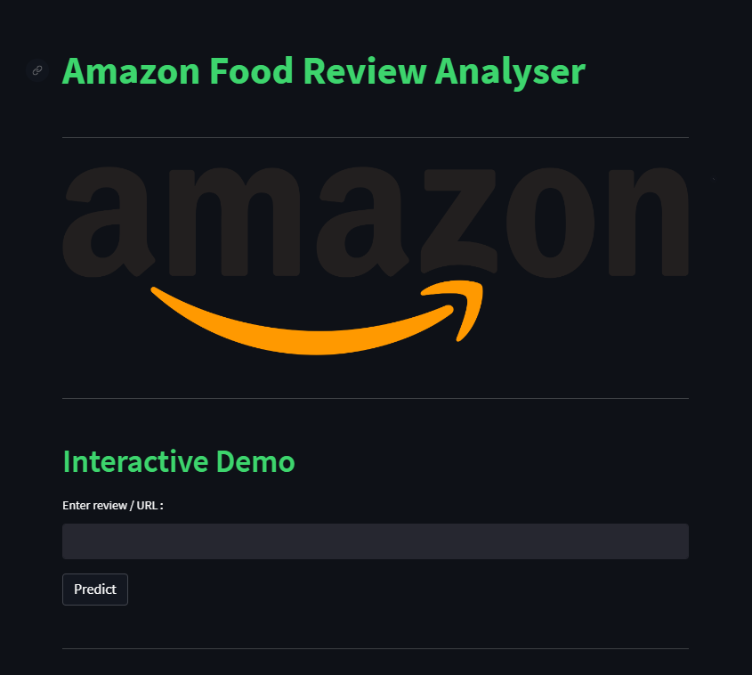

<h1>An Automated Text-based Classification System through Sentiment Analysis of Amazon Food Reviews</h1>

The goal of this work is to develop an automated text-based classification system that can accurately predict the helpfulness of Amazon online customer reviews. The problem considered is to perform a binary classification using the combination of text-based features and machine learning classification algorithms. The binary classes will be defined as - ‘1’ being ‘Helpful’ and ‘0’ being ‘Not helpful’. The helpfulness measure will be determined based on the number of users who voted the review as ‘helpful’.

The application is depoloyed using streamlit. 

https://gyan-krishna-amazon-food-review-user-interface-wtlb8g.streamlit.app/

### Instructions to try it out!
1. git clone https://github.com/gyan-krishna/Amazon_food_review.git
2. streamlit run User_interface.py

#### Libraries required:-
1. pip install streamlit
2. pip install pickle
3. pip install pandas
4. pip install nltk
5. pip install beautifulsoup4
6. pip install requests

#### Links for dataset:-
1. https://www.kaggle.com/datasets/snap/amazon-fine-food-reviews
### Final year project for completion of MSc Computer Science,
- Gyan Krishna Sreekar
- Soumili Mitra
- Srijita Das 

Dept of computer science, St. Xavier's College (Autonomous), Kolkata
